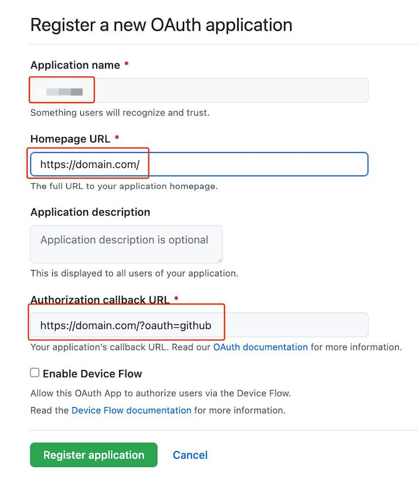
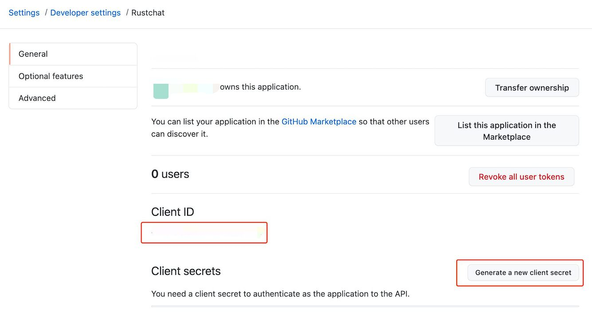

# How to set up Github Login

The steps of enabling Github Login are as follows:

### 1. Login to https://github.com/ ,

### 2. Access the URL below, and complete the required form:
[https://github.com/settings/applications/new](https://github.com/settings/applications/new)

get ClientID, ClientSecret:

### 3. Fill the clientID and ClientSecret into the vocechat settings:

