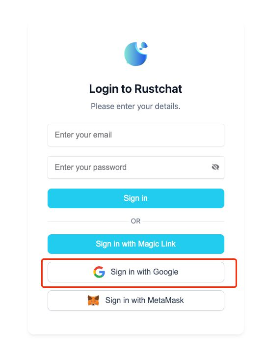
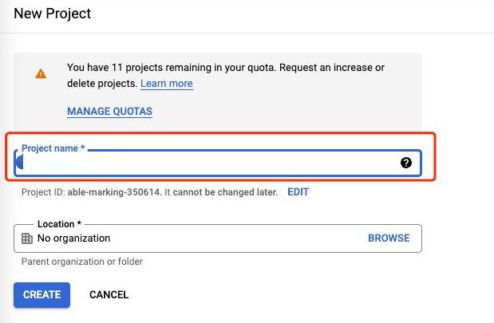
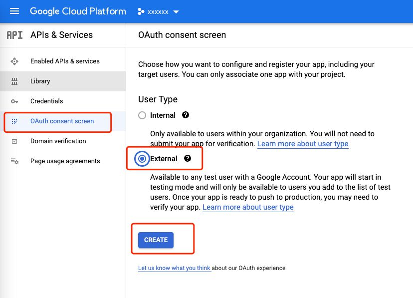
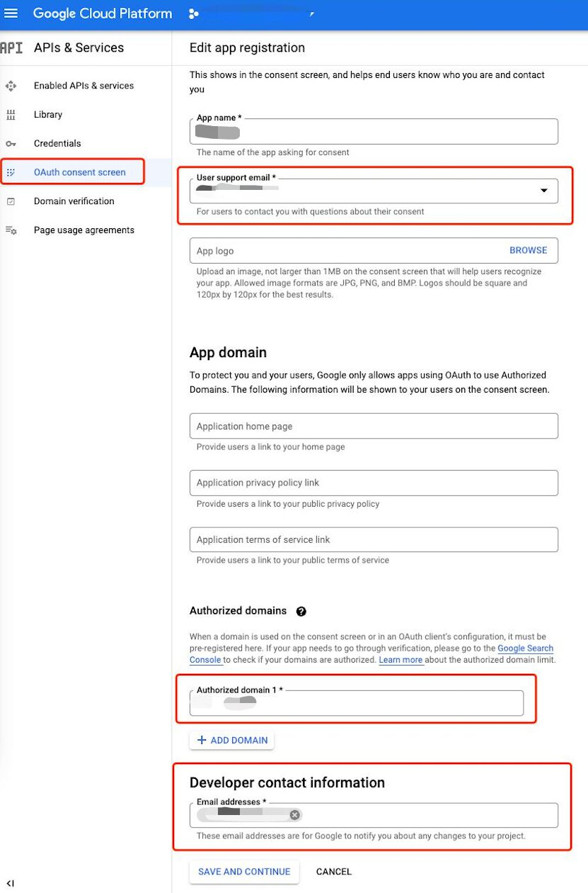
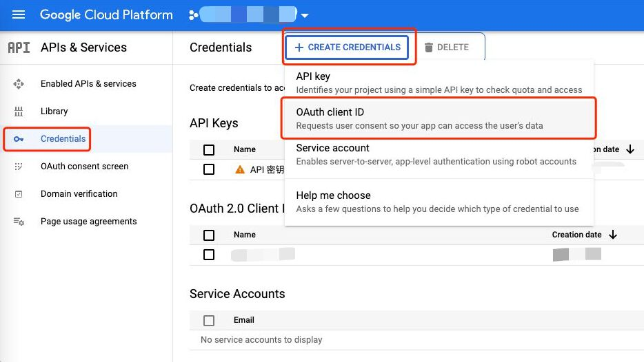
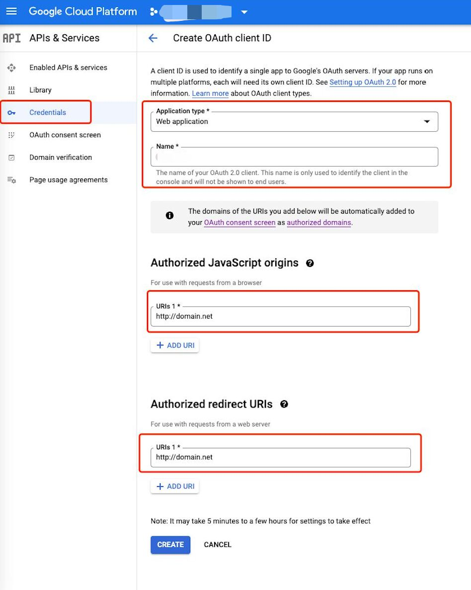
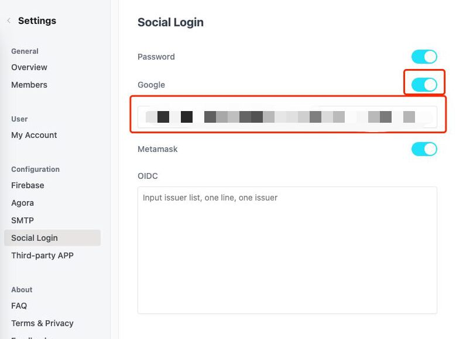

# How to set up Google Login?
After Google login is enabled, you may let new members sign in as follows:


Steps:

### 1. You need to use your top-level domain name
Google login application needs top-level domain names, and secondary domain names cannot be used for a separate application.

### 2. Open the Google console and create a new project
https://console.developers.google.com/apis  


### 3. Create a `consent screen`
  

For **Authorized domains**, if your **vocechat** is deployed on your domain, please fill it with your top-level domain. This top-level domain will be seen on consent screen of **Sign in with Google**.

For example: if your **vocechat** can be accessed via ```https://chat.domain.com/```, fill it with ```domain.com```. 



### 4. Create `credentials`
  

For **Authorized JavaScript origins**, type in the url that the front-end is deployed on.

For example: If you can see login page by visiting ```https://chat.domain.com/```,type it in the **Authorized JavaScript origins**. 

Leave **Authorized redict URIs** blank.


  
After this step, you will get the ClientID and PrivateKey.

### 5. Paste ClientID to Vocechat settings.
Paste the ClientID here.  

