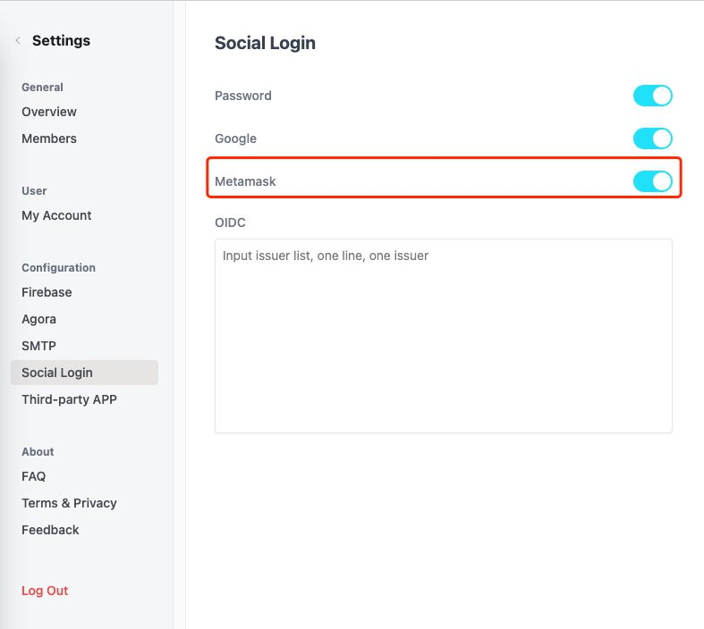
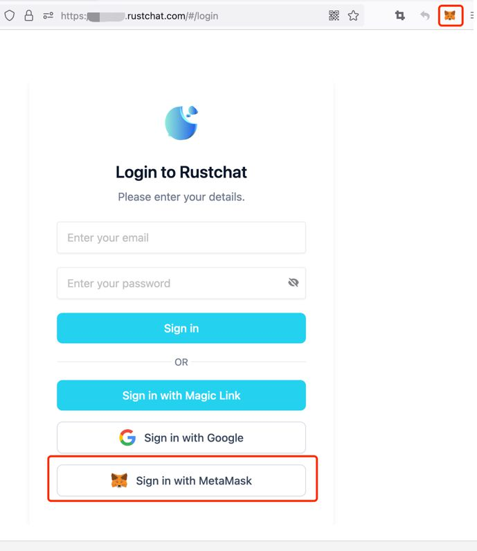

# Third party login - meta mask
Metamask is a browser based blockchain wallet, which can also be used to log in to third-party web apps. Vocechat supports Metamask login integration and this only needs one step to start.

### 1. Vocechat administrator logs in to the background, and enables the metamask login (no setup required):

### 2. User have to install the Metamask extension to use it.
Users need to install the metamask browser plug-in before logging in, and log in to metamask in advance.

