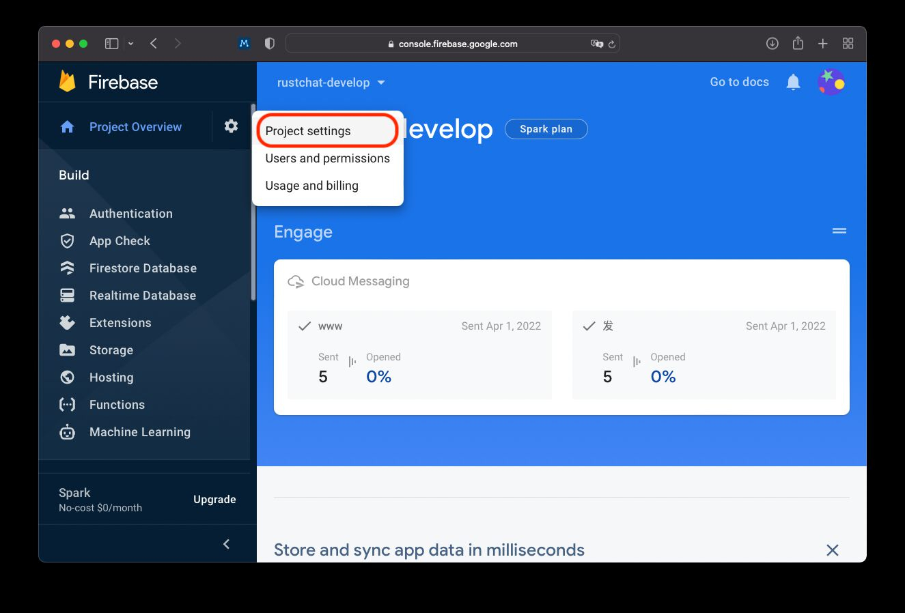
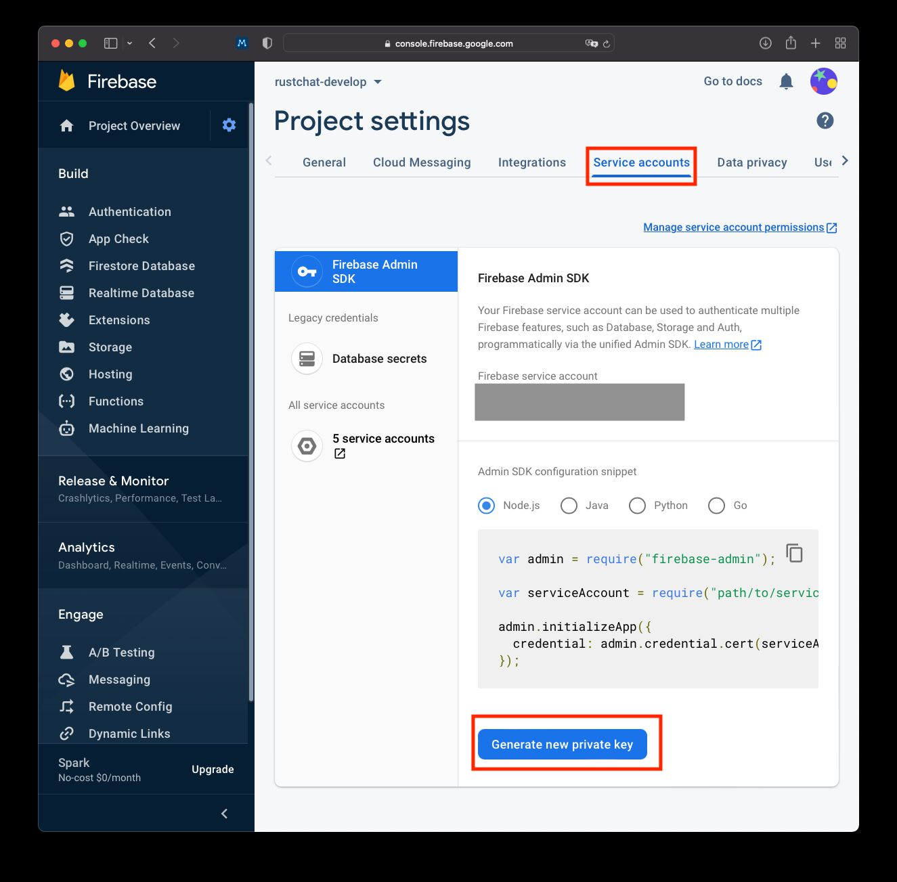
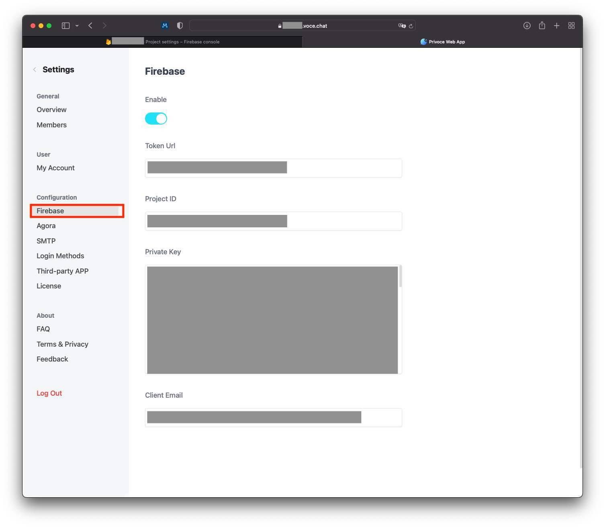

# How to configure the push notification service in Vocechat?

There are two steps: first, the administrator needs to obtain the configuration file from firebase, 
and then update the corresponding configuration information in the push settings of Vocechat.

The administrator needs to first create the firebase project and has added the corresponding service code to the project. 
If you have completed the above steps, you can skip this paragraph; 
If not, see [fcm](https://firebase.google.com/docs/cloud-messaging).

## 1. Get the configuration file from the `Firebase` console
Access [Firebase Console](https://console.firebase.google.com), 
Click the gear icon on the left sidebar to enter **Project Settings**

Then, in the horizontal tab at the top of the page, select **Service Accounts**. 
Drop down the page to the bottom, click **generate new private key**, and save the downloaded JSON file properly.

## 2. Copy relevant configuration items to rust chat settings
Enter **RustChat Settings** page, select **Firebase** in **Configuration** .

Four configuration items can be filled in this page, namely token URL, project ID, private key and client email. 
You can download in step 1 above Find the corresponding field in the JSON file, copy and paste it, and then save it.

